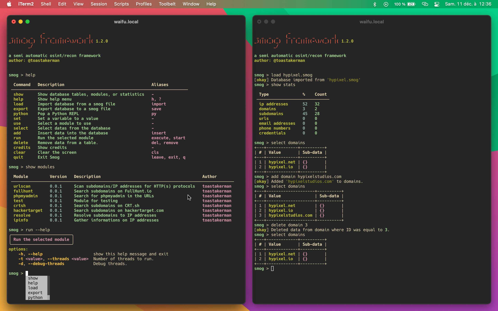

# Smog Framework

## A semi-automatic osint/recon framework.

## How to use it:

* `git clone https://github.com/traumatism/Smog/`

* `cd Smog`

* `pip3 install -r requirements.txt`

* `python3 -m smog`

* One line: `git clone https://github.com/traumatism/Smog/ && cd Smog && pip3 install -r requirements.txt && python3 -m smog`

Add a domain for example

* `add domain domain.com`

Scan for subdomains with differents modules

* `use crtsh`

* `run`

* `use hackertarget`

* `run`

...

Now lets use the data we gathered to resolve the subdomains to IP addresses

* `use resolve` 

* `run`

Then we can use another module to gather IP addresses informations

* `use ipinfo`

* `run`

The process is quasi-infinite. You can add more modules to get more informations and add modules that uses these informations (that why its "semi-automatic", the actions order is decided by the human)

## TODO:

### Modules

* URL scanning
* Endpoints scanning
* Vulnerability scanning

### Features

* Export to json or plain text
* Add a workspace system
* Multiple queries executions with ";" or "&&"
* Syntax highlighting
